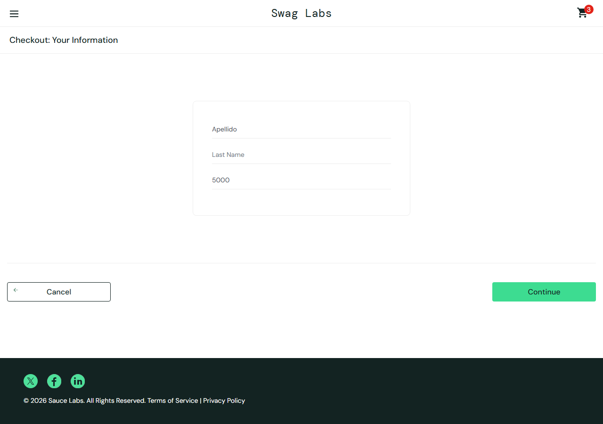
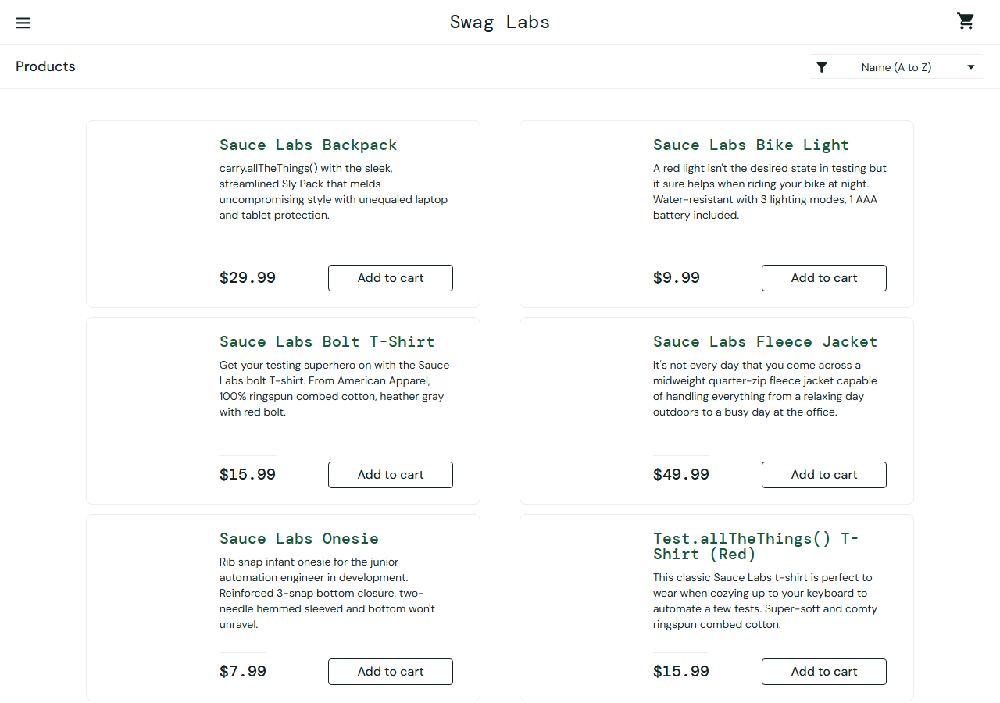

# Reportes de bugs · SauceDemo (`problem_user`)

Defectos encontrados al explorar [SauceDemo](https://www.saucedemo.com) con el usuario `problem_user`.

> **Contexto:** SauceDemo incluye este usuario con fallos **intencionales**, para practicar la detección y el reporte de bugs. Los defectos de abajo son reales en esa web, pero no son errores de un producto en producción. Lo que se muestra es el proceso: explorar, reproducir, documentar con evidencia y automatizar.

**Cómo se encontraron:** exploración guiada con el script [`scripts/explore-problem-user.js`](../scripts/explore-problem-user.js), que registró el comportamiento en [`evidence/problem-user-hallazgos.json`](evidence/problem-user-hallazgos.json). Cada bug tiene un test automatizado en [`tests/problem-user.spec.js`](../tests/problem-user.spec.js).

## Resumen

| ID | Título | Severidad | Prioridad | Módulo |
| --- | --- | --- | --- | --- |
| [BUG-005](#bug-005) | El apellido se escribe en el campo "First Name" y no se puede completar el checkout | Crítica | Alta | Checkout |
| [BUG-003](#bug-003) | No se pueden agregar 3 de los 6 productos al carrito | Alta | Alta | Catálogo |
| [BUG-004](#bug-004) | No se pueden quitar productos desde el catálogo (3 de 6) | Media | Media | Catálogo |
| [BUG-002](#bug-002) | El ordenamiento del catálogo no tiene efecto | Media | Media | Catálogo |
| [BUG-001](#bug-001) | Ningún producto muestra su imagen | Baja | Media | Catálogo |

**Escala de severidad:** *Crítica* impide completar el flujo principal (la compra) · *Alta* bloquea una función importante · *Media* la función existe pero falla · *Baja* afecta solo la presentación.

## Entorno (común a todos los bugs)

| Dato | Valor |
| --- | --- |
| URL | https://www.saucedemo.com |
| Usuario | `problem_user` |
| Navegador | Chromium (Desktop Chrome, 1280×900) vía Playwright 1.63 |
| Fecha | 05/10/2026 |
| Precondición | Haber iniciado sesión como `problem_user` |

---

## BUG-005
### El apellido se escribe en el campo "First Name" y no se puede completar el checkout

- **Severidad:** Crítica · **Prioridad:** Alta · **Módulo:** Checkout
- **Test automatizado:** `BUG-005` en `tests/problem-user.spec.js`

**Pasos para reproducir**
1. Iniciar sesión como `problem_user`.
2. Agregar "Sauce Labs Backpack" al carrito.
3. Abrir el carrito y presionar **Checkout**.
4. Completar **First Name** = `Nombre`, **Last Name** = `Apellido` y **Zip/Postal Code** = `5000`.

**Resultado esperado:** cada dato queda en su campo: First Name = `Nombre` y Last Name = `Apellido`.

**Resultado actual:** al escribir en **Last Name**, el texto se coloca en **First Name** y **Last Name** queda vacío. El campo First Name queda con `Apellido`. Al presionar **Continue** aparece `Error: Last Name is required` y no se avanza al siguiente paso.

**Impacto:** el usuario no puede finalizar ninguna compra.

**Evidencia:** 

---

## BUG-003
### No se pueden agregar 3 de los 6 productos al carrito

- **Severidad:** Alta · **Prioridad:** Alta · **Módulo:** Catálogo
- **Test automatizado:** `BUG-003` (uno por producto) en `tests/problem-user.spec.js`

**Pasos para reproducir**
1. Iniciar sesión como `problem_user`.
2. En el catálogo, presionar **Add to cart** en "Sauce Labs Bolt T-Shirt", "Sauce Labs Fleece Jacket" o "Test.allTheThings() T-Shirt (Red)".

**Resultado esperado:** el botón cambia a **Remove** y el contador del carrito aumenta en 1.

**Resultado actual:** no ocurre nada. El botón sigue diciendo **Add to cart** y el contador no cambia. Con los otros tres productos (Backpack, Bike Light y Onesie) agregar sí funciona.

**Impacto:** la mitad del catálogo no se puede comprar.

**Evidencia:** [`carrito-problem-user.png`](evidence/carrito-problem-user.png) y la sección 3 de [`problem-user-hallazgos.json`](evidence/problem-user-hallazgos.json).

---

## BUG-004
### No se pueden quitar productos desde el catálogo (3 de 6)

- **Severidad:** Media · **Prioridad:** Media · **Módulo:** Catálogo
- **Test automatizado:** `BUG-004` (uno por producto) en `tests/problem-user.spec.js`

**Pasos para reproducir**
1. Iniciar sesión como `problem_user`.
2. Presionar **Add to cart** en "Sauce Labs Backpack" (el botón pasa a **Remove**).
3. Presionar **Remove**.

**Resultado esperado:** el botón vuelve a **Add to cart** y el contador del carrito disminuye.

**Resultado actual:** el botón sigue en **Remove** y el contador no cambia. Ocurre con Backpack, Bike Light y Onesie.

**Impacto:** el usuario no puede deshacer lo que agregó desde el catálogo.

**Pendiente de verificar:** si el producto sí se puede quitar desde la pantalla del carrito (no se probó en esta exploración).

**Evidencia:** [`carrito-problem-user.png`](evidence/carrito-problem-user.png) y la sección 3 de [`problem-user-hallazgos.json`](evidence/problem-user-hallazgos.json).

---

## BUG-002
### El ordenamiento del catálogo no tiene efecto

- **Severidad:** Media · **Prioridad:** Media · **Módulo:** Catálogo
- **Test automatizado:** `BUG-002` en `tests/problem-user.spec.js`

**Pasos para reproducir**
1. Iniciar sesión como `problem_user`.
2. Abrir el selector de orden y elegir **Name (Z to A)**, **Price (low to high)** o **Price (high to low)**.

**Resultado esperado:** la lista se reordena según la opción elegida.

**Resultado actual:** la lista conserva siempre el orden original (Backpack, Bike Light, Bolt T-Shirt, Fleece Jacket, Onesie, Red T-Shirt), con las tres opciones probadas.

**Evidencia:** 

---

## BUG-001
### Ningún producto muestra su imagen

- **Severidad:** Baja · **Prioridad:** Media · **Módulo:** Catálogo
- **Test automatizado:** `BUG-001` en `tests/problem-user.spec.js`

**Pasos para reproducir**
1. Iniciar sesión como `problem_user`.
2. Observar el catálogo.

**Resultado esperado:** cada producto muestra su propia imagen.

**Resultado actual:** los 6 productos usan la misma ruta de imagen (`/assets/sl-404-…jpg`, una imagen de error) y en pantalla el espacio de la imagen aparece vacío.

**Evidencia:** 
